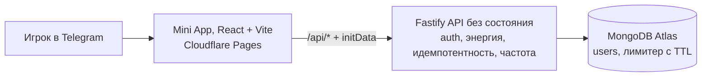
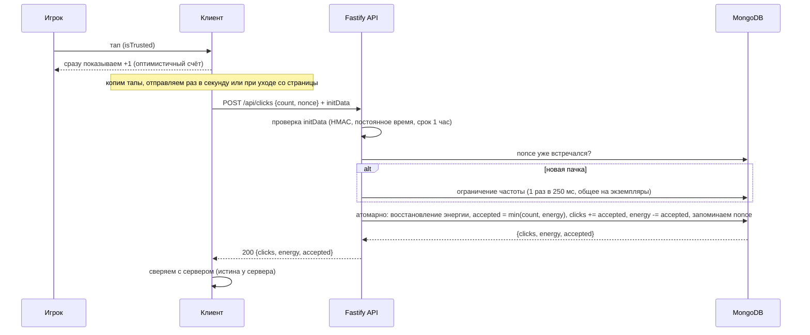

# Taptap clicker

Telegram Mini App: кликер с лидербордом. Игрок тапает монету, счёт растёт, а темп ограничен энергией,
как в Notcoin или Hamster. Есть топ-25 и личное место в рейтинге, даже когда игрок в топ не попал.
Считает всё сервер, он же отвечает за защиту от накрутки. Клиент показывает счёт сразу и затем
сверяет его с сервером.

Стек ограничен условиями задания: **только TypeScript, React, Node.js и MongoDB**. Без Redis,
очередей и тяжёлых фреймворков. Там, где для большого масштаба напрашивается другая инфраструктура,
это описано как осознанный компромисс, а не недосмотр (см. раздел "Ключевые решения").

## Стек

- **client**: TypeScript, React, Vite, Tailwind. Состояние на нативных хуках, локализация ru/en своими силами, без библиотек.
- **backend**: TypeScript, Fastify 5, Mongoose 8, TypeBox. Схемы проверяются и при компиляции, и во время выполнения.
- **shared**: общий контракт API и константы, импорт по алиасу `@shared/`*. Одни и те же типы и числа на клиенте и на сервере.
- **Тесты**: Vitest (unit и integration) и Playwright (API и UI e2e). Integration и e2e поднимают настоящую MongoDB через Testcontainers.

## Архитектура




Бэкенд устроен как набор HTTP-эндпоинтов без собственного состояния (stateless): нет сессий и ничего
не держится в памяти процесса, кроме короткого кэша лидерборда. Авторизация проверяется по подписи
Telegram `initData` на каждом запросе, а все данные лежат в MongoDB. Благодаря этому сервер
масштабируется горизонтально без изменений: несколько одинаковых экземпляров за балансировщиком,
общий лимитер и общие данные в Mongo.

Деплой раздельный: клиент на Cloudflare Pages, бэкенд отдаёт только `/health` и `/api/*`, а доступ с
адреса Pages открыт через CORS.

## Источник истины и серверная логика

Единственный источник истины (single source of truth) это сервер и MongoDB. Клиент не хранит
итоговый счёт и не может его задать. Он отправляет только то, на сколько вырос счётчик с прошлой
отправки (дельту кликов), а сервер сам пересчитывает результат и возвращает настоящие значения
`clicks` и `energy`.

При этом клиент показывает счёт сразу, не дожидаясь ответа (оптимистичный счёт), а когда ответ
приходит, подставляет числа сервера. Если оптимистичная оценка разошлась с сервером, например
из-за нехватки энергии, выигрывает сервер.

У такой стратегии два эффекта сразу. Во-первых, накрутить итог нельзя, потому что итога на клиенте
просто нет, есть только заявка на прирост, которую сервер проверяет. Во-вторых, при нескольких
вкладках или устройствах счёт остаётся согласованным, потому что считается в одном месте.

## Ключевые решения

**Защита от накрутки барьерами.** Это не одна проверка, а последовательность барьеров (подробности в
разделе "Защита от накрутки"): фильтр `isTrusted` на клиенте, затем подпись `initData`, ограничение
частоты, ограничение по энергии, защита от повторов по `nonce` и атомарная запись. Каждый барьер
закрывает свой тип атак, и если один обойдён, счёт всё равно не открывается.

**MongoDB вместо Redis, и для частоты, и для лидерборда.** В стеке задания Redis нет, поэтому обе
задачи решены на Mongo:

- Ограничение частоты: распределённый лимитер с фиксированным окном. Запись по ключу с TTL-индексом, и
если в открытом окне приходит дубликат ключа, запрос получает 429. Работает корректно сразу на
нескольких экземплярах.
- Лидерборд: индекс `{ clicks: -1, _id: 1 }`, короткий кэш топ-25 в памяти (1 секунда) и расчёт места
без отдельного запроса, если игрок уже в топе.
- Как масштабировать дальше (честно): на объёмах уровня Hamster здесь напрашивается Redis. ZSET даёт
лидерборд и место за O(log n) через `ZADD` и `ZREVRANK`, один общий снимок вместо отдельного кэша на
каждом экземпляре и более дешёвую операцию для лимитера (`INCR` вместо записи в коллекцию). В рамках
задания тяжёлую инфраструктуру сознательно не добавляю.

**Лидерборд это опрос кэша, а не рассылка обновлений.** Клиент раз в 4 секунды запрашивает
`/api/leaderboard`, сервер отдаёт топ-25 из кэша (живёт 1 секунду). Нагрузку чтения держит этот кэш:
сколько бы игроков ни опрашивали рейтинг, тяжёлый запрос к Mongo уходит максимум раз в секунду на
экземпляр. Ограничение частоты стоит там, где есть накрутка — на записи (`POST /api/clicks`), а не на
чтении рейтинга. Это осознанный выбор против WebSocket и SSE. Лидерборд меняется постоянно,
и рассылать каждое изменение всем игрокам означало бы огромный объём бесполезного трафика, а миллионы
постоянных соединений свели бы на нет горизонтальное масштабирование (привязка соединений к
экземпляру, состояние на каждое соединение). Опрос кэша объединяет всю эту нагрузку в один дешёвый
запрос. Постоянные соединения уместны для редких персональных событий, например своего баланса между
устройствами или уведомлений, но не для общего рейтинга, который обновляется каждую секунду.

**Никаких тяжёлых зависимостей на клиенте.** Состояние держим на нативных хуках (`useReducer` и
`useState`), без Redux и Zustand. Локализация ru/en это свой небольшой модуль, без библиотеки. Для двух экранов так короче и понятнее, чем подключать менеджер состояния и i18n библиотеку.

## Защита от накрутки




- **Подпись `initData`.** HMAC-SHA256 со сравнением за постоянное время (`timingSafeEqual`). Срок жизни
1 час против повторного использования перехваченных данных, а слишком "будущая" дата (больше чем на
60 секунд вперёд) отклоняется на случай рассинхронизации часов. Проверка не требует состояния.
- **Ограничение по энергии.** `accepted = min(count, energy)`. Энергия восстанавливается по времени
сервера (максимум 100, по 3 в секунду, полный заряд примерно за 33 секунды). Накликать больше, чем
позволяет энергия, не получится. Причём это ограничение действует не на одну пачку, а на весь счёт:
энергия копится медленно, поэтому за одинаковое время в игре выходит примерно одинаковое число кликов,
как их ни отправляй. Послать разом большую пачку не значит набрать больше: так лишь быстрее тратится
уже накопленная энергия. Клики придут раньше, но не в большем количестве, и обогнать живого игрока с
тем же временем в игре так нельзя.
- **Защита от повторов по `nonce`.** Каждая пачка несёт свой `nonce`, сервер хранит кольцо из последних
100 на игрока. Повтор с тем же `nonce` ничего не меняет: ни энергия, ни счёт не двигаются. Поэтому
потерянный ответ при повторной отправке не задваивает клики. Более того, повтор со знакомым `nonce`
даже не тратит лимит частоты.
- **Потолок пачки.** `count` в диапазоне от 1 до 20, тело запроса не больше 4 КБ. TypeBox отсекает мусорный запрос ещё до обработчика. Это не лимитер темпа, а размер куска на один запрос: клиент сам режет пачку до этого предела и досылает остаток следующим флашем. Настоящий темп держит энергия.
- **Атомарность.** Восстановление энергии, ограничение и увеличение счёта выполняются одним конвейером
агрегации (aggregation pipeline) внутри `findOneAndUpdate`, без схемы чтение-изменение-запись и без
гонок. Спам при нулевой энергии не сдвигает отметку времени восстановления вперёд.
- **Барьер на клиенте.** Фильтр `isTrusted` первым и самым дешёвым шагом отсекает синтетические
события. Это удобство, а не безопасность: безопасность обеспечивает сервер.

## Бэкенд

```
backend/src/
  server.ts, app.ts         сборка приложения и запуск
  plugins/                  env (типизированный конфиг), auth (initData -> req.user)
  core/                     auth (HMAC), errors (типизированные), db (модели и индексы), rate-limit
  modules/clicker/          POST /clicks, GET /me: handlers, service, routes, schemas
  modules/leaderboard/      GET /leaderboard: кэш топ-25, расчёт места
  tools/signInitData.ts     подпись dev-initData для тестов вне Telegram
```

- **Контракт через TypeBox.** Тело и ответ каждого роута описаны схемой, а типы выводятся из неё. Если
контракт и код разойдутся, это поймает компилятор.
- **Единый формат ошибок.** `{ error: { code, message } }`, где `code` это одно из `VALIDATION`,
`UNAUTHORIZED`, `RATE_LIMITED`, `INTERNAL`. На неизвестный `/api/`* отдаём JSON с кодом 404.
- **Конфиг в одном месте.** `@fastify/env` и TypeBox проверяют переменные окружения на старте. Всё
настраивается через окружение и имеет значения по умолчанию: частоты, энергия, размеры пулов и
таймауты Mongo, лимит тела запроса, задержка остановки.
- **Аккуратная остановка.** `close-with-grace` плавно завершает текущие запросы перед выходом. Энергия
не пересчитывается по таймеру: она вычисляется от отметки `energyAt` в момент чтения. Профиль из
Telegram обновляется не чаще, чем раз в `PROFILE_SYNC_MS`.

### API


| Метод  | Путь               | Назначение                                                              |
| ------ | ------------------ | ----------------------------------------------------------------------- |
| `GET`  | `/health`          | `{ ok: true }`                                                          |
| `GET`  | `/api/me`          | профиль: `clicks`, `energy`, `energyMax`, `regenPerSec`                 |
| `POST` | `/api/clicks`      | принимает `{ count, nonce }`, возвращает `{ clicks, energy, accepted }` |
| `GET`  | `/api/leaderboard` | `{ top: [25], me: { rank, clicks } }`                                   |


Авторизация: заголовок `Authorization: tma <initData>` на всех `/api/`*.

## Клиент

Структура по принципу Feature-Sliced, но без лишних слоёв: `features/` для доменов и `shared/` для
переиспользуемого. Канонические `entities`, `widgets` и `pages` для двух экранов были бы избыточны.

```
client/src/
  features/clicker/      ClickerScreen, useClicker (пачки и сверка), ui/, particles/
  features/leaderboard/  LeaderboardScreen, useLeaderboard (опрос), ui/ (подиум, своё место)
  shared/                ui/, api, локализация, telegram, форматирование, ErrorBoundary
```

- **Оптимистичный показ и сверка.** Тап рисуется сразу. Тапы копятся и отправляются раз в секунду или
при уходе со страницы (события `pagehide` и `visibilitychange`). Уходит дельта и `nonce`, а числа из
ответа сервера (`clicks` и `energy`) считаются истиной и заменяют оптимистичную оценку. Энергия в
интерфейсе обновляется каждые 250 мс, чтобы шкала шла плавно.
- **Экраны и их состояния.** Два экрана, Кликер и Лидеры. На каждом обработаны загрузка (скелетон),
готовое состояние, пустые данные и ошибка или офлайн (`StateMessage`, `StatusPill`, `WifiOff`).
Сверху корневой `ErrorBoundary`.
- **Интеграция с Telegram.** WebApp SDK, тема оформления, хаптик на тапе. Для отладки вне Telegram есть подписанная dev-`initData` (`tools/signInitData.ts` и переменная `VITE_DEV_INIT_DATA`).
- **Детали.** Общий генератор частиц `StarField`: на тапе короткий разлёт звёзд, а у победителя в
рейтинге постоянное мягкое поле на чистом CSS без перерисовок React. Плюс шкала энергии, круговой
прогресс, подиум топ-3 и аватар-градиент по идентификатору.

## Тестирование

```bash
npm --prefix backend run test:unit          # энергия, валидация initData
npm --prefix backend run test:integration   # лидерборд, идемпотентная пачка (Testcontainers Mongo)
npm --prefix backend test                    # API e2e (Playwright + Testcontainers)
npm --prefix client test                     # хуки, компоненты, api, локализация (Vitest + Testing Library)
npm run test:ui                              # сквозной браузерный e2e: клиент + бэкенд + Mongo
```

CI прогоняет это на каждый пуш, файл `.github/workflows/ci.yml`.

## Локальный запуск

```bash
npm install
npm --prefix backend install
npm --prefix client install

docker compose up -d                 # MongoDB на :27017 (тот же mongo:7, что в тестах)
cp backend/.env.example backend/.env # заполнить BOT_TOKEN, MONGODB_URI

npm --prefix backend run dev         # Fastify
npm --prefix client run dev          # Vite на :5173, /api проксируется в бэкенд
```

Вне Telegram клиенту нужен подписанный `VITE_DEV_INIT_DATA`, иначе сервер ответит 401. Сгенерировать
тем же `BOT_TOKEN`, что в `backend/.env`:

```bash
BOT_TOKEN=<тот-же> npm --prefix backend run dev:init-data   # запишет client/.env
```

## Деплой

Раздельный: **Cloudflare Pages** (клиент), **бэкенд только с API** (Railway, Render или Fly) и
**MongoDB Atlas**.

**1. MongoDB Atlas.** Создать бесплатный кластер M0, пользователя с парольной авторизацией, открыть
Network Access (для теста проще `0.0.0.0/0`, в проде уже). Строка подключения вида
`mongodb+srv://<user>:<pass>@<cluster>.mongodb.net/?retryWrites=true&w=majority`, это `MONGODB_URI`.
Имя базы задаётся отдельно в `MONGODB_DB`.

**2. Бэкенд (только API).** Корень `backend`, сборка `npm ci && npm run build`, запуск `npm start`.
Переменные:


| Ключ          | Значение                                                           |
| ------------- | ------------------------------------------------------------------ |
| `MONGODB_URI` | строка из Atlas                                                    |
| `MONGODB_DB`  | `cryptoclicker`                                                    |
| `BOT_TOKEN`   | токен от BotFather                                                 |
| `CORS_ORIGIN` | финальный адрес Pages, например `https://crypto-clicker.pages.dev` |


`PORT` задаёт платформа. Проверка: `https://<backend>/health` отвечает `{ "ok": true }`.

**3. Cloudflare Pages (клиент).** Из того же репозитория. Корень `client`, сборка
`npm ci && npm run build`, каталог сборки `dist`. Переменная `VITE_API_URL = https://<backend>/api`.
После первого деплоя вписать финальный адрес Pages в `CORS_ORIGIN` бэкенда и перезапустить его.

**4. BotFather.** `/mybots`, выбрать бота, **Bot Settings, Menu Button, Edit menu button URL**, указать
адрес Pages (не бэкенда). Открыть Mini App из Telegram: тап растит счёт, "Лидеры" показывают топ-25 и
своё место.

**Гигиена токена.** `BOT_TOKEN` хранится только в переменных окружения бэкенда. Если он засветился
(логи, скриншоты, демо), перевыпустить в BotFather (`/token`) и обновить переменную.

## Осознанные упрощения и развитие на проде

Что специально не сделано в рамках задания и куда расти:

- **Redis ZSET или материализованный лидерборд** для масштаба: место и топ-N за O(log n), один общий снимок.
- **Sentry** и отправка структурированных логов для наблюдаемости на проде.
- **Живой лидерборд** (WebSocket или SSE), если бизнесу понадобится реальное время. По умолчанию осознанно выбран опрос кэша.
- **Длительная автоматизация.** Энергия ограничивает темп, но не присутствие: бот может собирать восстановленную энергию круглосуточно, без живого игрока. На проде сюда добавил бы поведенческие эвристики и детект аномалий (неестественно ровная активность сутками), суточные лимиты, при необходимости проверку правдоподобной скорости тапа.
- **Ограничение частоты по IP** и эвристики против злоупотреблений, менеджер секретов и ротация `BOT_TOKEN`.
- **CDN для статики**, что в раздельном деплое уже частично закрывает Cloudflare Pages.
- Redis здесь добавил бы скорость под конкретные задачи.

Горизонтальное масштабирование (несколько экземпляров без состояния плюс Mongo) работает уже сейчас.
