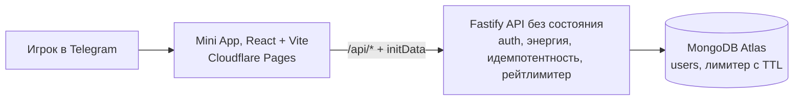

# Taptap clicker

Bot: https://t.me/crypto_tap_tap_bot/app

Telegram Mini App: кликер с лидербордом. Игрок тапает монету, счёт растёт, а темп роста ограничен энергией, как в Notcoin или Hamster. Есть лидерборд топ-25 и личное место в рейтинге, даже если игрок в топ не попал. Считает всё сервер, он же отвечает за защиту от накрутки. Клиент показывает счёт сразу и затем сверяет его с сервером.

<p align="center">
  
  
  
  
  
</p>

<p align="center">
  <video src="https://github.com/dgtpizza/taptap/raw/main/screenshots/video.mov" controls width="60%">
    <a href="https://github.com/dgtpizza/taptap/raw/main/screenshots/video.mov">Демо (видео)</a>
  </video>
</p>

> [!NOTE]
> Стек ограничен условиями задания: **только TypeScript, React, Node.js и MongoDB**. Без Redis, очередей и тяжёлых фреймворков.

---

## 🧰 Стек


| Слой        | Стек и детали                                                                                                                |
| ----------- | ---------------------------------------------------------------------------------------------------------------------------- |
| **client**  | TypeScript, React + React Router, Vite, Tailwind. Состояние на Context-слайсах и нативных хуках, локализация ru/en своими силами.              |
| **backend** | TypeScript, Fastify, Mongoose, TypeBox. Схемы проверяются и при компиляции, и во время выполнения.                           |
| **shared**  | Общий контракт API и константы, импорт по алиасу `@shared/`*. Одни и те же типы и числа на клиенте и на сервере.             |
| **Тесты**   | Vitest (unit и integration) и Playwright (API и UI e2e). Integration и e2e поднимают настоящую MongoDB через Testcontainers. |


---

## 🏗️ Архитектура




Бэкенд устроен как набор HTTP-эндпоинтов без собственного состояния (stateless): нет сессий и ничего не держится в памяти процесса, кроме небольшого кэша лидерборда.

Авторизация проверяется по подписи Telegram `initData` на каждом запросе, а все данные лежат в MongoDB. Благодаря этому сервер без проблем масштабируется горизонтально: несколько одинаковых экземпляров за балансировщиком, общий лимитер и общие данные в Mongo.

Деплой раздельный: клиент на Cloudflare Pages, бэкенд отдаёт только `/health` и `/api/*`, а доступ с
адреса Pages открыт через CORS.

---

## 🎯 Источник истины и серверная логика

Единственный источник истины (single source of truth) в MongoDB. Клиент не хранит итоговый счёт и не может его задать. Он отправляет только то, на сколько вырос счётчик с прошлой отправки (дельту кликов), а сервер сам пересчитывает результат и возвращает настоящие значения `clicks` и `energy`.

При этом клиент показывает счёт сразу, не дожидаясь ответа (оптимистичный счёт), а когда ответ
приходит, подставляет числа сервера. Если оптимистичная оценка разошлась с сервером, например
из-за нехватки энергии, выигрывает сервер.

У такой стратегии есть два эффекта:

- **Во-первых**, накрутить итог нельзя, потому что итога на клиенте просто нет, есть только заявка
на прирост, которую сервер проверяет.
- **Во-вторых**, при нескольких вкладках или устройствах счёт остаётся согласованным, потому что
считается в одном месте.

---

## 💡 Ключевые решения

### Энергия как единый рейтлимитер

Темп держит не отдельная проверка скорости тапа, а энергия: по сути токен-бакет с запасом 100 и пополнением 3 в секунду по часам сервера. Один механизм ограничивает и короткий всплеск, и устойчивый темп, поэтому отдельный лимит "кликов в секунду" я сознательно не вводил, он бы только дублировал энергию. А `MAX_BATCH` это не лимитер, а лишь размер куска на один запрос.

### Идемпотентность без отдельного стора

Чтобы повторная отправка пачки (ретрай при обрыве сети) не задвоила клики, каждая пачка несёт `nonce`, а сервер помнит последние 100 на игрока. Отдельное хранилище для дедупликации или транзакции не понадобились: проверка `nonce`, восстановление энергии, ограничение и инкремент идут одной атомарной операцией Mongo, без чтения-изменения-записи и без гонок.

### Без Redis: рейтлимитер на Mongo, кэш в памяти

Redis обычно берут под рейтлимитер и кэш, но в стеке задания его нет. Рейтлимитер сделан на Mongo: запись по ключу с TTL-индексом, дубликат ключа в открытом окне ловит 429, и это корректно работает сразу на нескольких экземплярах. Лидерборд читается из Mongo по индексу `{ clicks: -1, _id: 1 }`, а перед ним стоит короткий кэш топ-25 в памяти процесса (1 секунда); место игрока из топа берётся без отдельного запроса. На масштабе уровня Hamster сюда просился бы Redis ZSET (ранг за O(log n), общий снимок на все экземпляры, дешёвый `INCR` вместо записи), но тащить Redis в инфраструктуру я не стал.

### Лидерборд опросом, а не WS/SSE

Клиент опрашивает `/api/leaderboard` раз в 4 секунды и получает кэшированный топ-25, а сам запрос ограничен лимитом раз в секунду на игрока. Лимит здесь не лишний: личное место игрока вне топа считается через `countDocuments` в обход кэша, и без него этот запрос можно было бы заспамить (обычный опрос раз в 4 секунды в лимит не упирается). Рассылку каждого изменения через WebSocket или SSE я сознательно не делал: рейтинг меняется постоянно, слать всем каждое обновление означало бы гонять море бесполезного трафика, а миллионы постоянных соединений убили бы горизонтальное масштабирование. Опрос кэша сводит всё это к одному дешёвому запросу, а постоянные соединения приберёг бы для редких персональных событий, например своего баланса между устройствами.

### Единый контракт в shared/

Типы API и константы (`FLUSH_MS`, `MAX_BATCH`, параметры энергии) лежат в общем пакете `shared/` и импортируются и клиентом, и сервером. Числа не разъезжаются между двумя сторонами, а схемы на TypeBox проверяют запросы во время выполнения и заодно дают типы: если контракт разойдётся с кодом, это поймает компилятор ещё до запуска.

### Stateless-бэкенд и раздельный деплой

Бэкенд не держит состояния в процессе (кроме секундного кэша лидерборда), все данные в Mongo, а лимитер общий через ту же базу. Поэтому масштабирование это просто несколько одинаковых экземпляров за балансировщиком, без привязки игрока к конкретному экземпляру. Клиент отдаётся отдельно с CDN (Cloudflare Pages), а бэкенд остаётся чистым API. Плата за это CORS и две площадки вместо одного origin.

### Минимум зависимостей на клиенте

Из библиотек только React Router (навигация и системные экраны). Менеджер состояния не подключал: состояние держится на Context-слайсах и нативных хуках (`useReducer`, `useState`), детали ниже в разделе «Клиент». Локализация ru/en самописная. Для пары экранов это короче и понятнее, чем тащить Redux/Zustand и i18n-библиотеку.

---

## 🛡️ Защита от накрутки


- **Подпись `initData`.** HMAC-SHA256 со сравнением за постоянное время (`timingSafeEqual`). Срок жизни
1 час против повторного использования перехваченных данных, а слишком "будущая" дата (больше чем на
60 секунд вперёд) отклоняется на случай рассинхронизации часов. Проверка не требует состояния.
- **Ограничение по энергии.** `accepted = min(count, energy)`. Энергия восстанавливается по времени
сервера (максимум 100, по 3 в секунду, полный заряд примерно за 33 секунды). Накликать больше, чем
позволяет энергия, не получится.
  > [!TIP]
  > Причём это ограничение действует **не на одну пачку, а на весь счёт**: энергия копится медленно,
  > поэтому за одинаковое время в игре выходит примерно одинаковое число кликов, как их ни отправляй.
  > Послать разом большую пачку не значит набрать больше: так лишь быстрее тратится уже накопленная
  > энергия. Клики придут раньше, но не в большем количестве, и обогнать живого игрока с тем же
  > временем в игре так нельзя.
- **Защита от повторов по `nonce`.** Каждая пачка несёт свой `nonce`, сервер хранит кольцо из последних
100 на игрока. Повтор с тем же `nonce` ничего не меняет: ни энергия, ни счёт не двигаются. Поэтому
потерянный ответ при повторной отправке не задваивает клики. Более того, повтор со знакомым `nonce`
даже не тратит рейтлимитер.
- **Потолок пачки.** `count` в диапазоне от 1 до 20, тело запроса не больше 4 КБ. TypeBox отсекает
мусорный запрос ещё до обработчика. Это не лимитер темпа, а размер куска на один запрос: клиент сам
режет пачку до этого предела и досылает остаток следующим флашем. Настоящий темп держит энергия.
- **Атомарность.** Восстановление энергии, ограничение и увеличение счёта выполняются одним конвейером
агрегации (aggregation pipeline) внутри `findOneAndUpdate`, без схемы чтение-изменение-запись и без
гонок. Спам при нулевой энергии не сдвигает отметку времени восстановления вперёд.
- **Барьер на клиенте.** Фильтр `isTrusted` первым и самым дешёвым шагом отсекает синтетические
события. Это удобство, а не безопасность: безопасность обеспечивает сервер.

**Параметры по умолчанию** (всё настраивается через переменные окружения):


| Параметр                          | Значение                         |
| --------------------------------- | -------------------------------- |
| Энергия, максимум                 | 100                              |
| Восстановление энергии            | 3 в секунду (полный заряд ~33 с) |
| Потолок пачки (`MAX_BATCH`)       | 20 кликов на запрос              |
| Тело запроса                      | не больше 4 КБ                   |
| Лимит записи (`POST /api/clicks`) | 1 раз в 250 мс на игрока         |
| Лимит чтения лидерборда           | 1 раз в секунду на игрока        |
| Память `nonce` на игрока          | последние 100                    |
| Срок жизни `initData`             | 1 час                            |
| Кэш лидерборда                    | 1 секунда                        |
| Опрос лидерборда клиентом         | каждые 4 секунды                 |


---

## ⚙️ Бэкенд

```
backend/src/
├── server.ts, app.ts         сборка приложения и запуск
├── plugins/                  env (типизированный конфиг), auth (initData -> req.user)
├── core/                     auth (HMAC), errors (типизированные), db (модели и индексы), rate-limit
├── modules/
│   ├── clicker/              POST /clicks, GET /me: handlers, service, routes, schemas
│   └── leaderboard/          GET /leaderboard: кэш топ-25, расчёт места
└── tools/signInitData.ts     подпись dev-initData для тестов вне Telegram
```

- **Контракт через TypeBox.** Тело и ответ каждого роута описаны схемой, а типы выводятся из неё. Если
контракт и код разойдутся, это поймает компилятор.
- **Единый формат ошибок.** `{ error: { code, message } }`, где `code` это одно из `VALIDATION`,
`UNAUTHORIZED`, `RATE_LIMITED`, `INTERNAL`. На неизвестный `/api/`* отдаём JSON с кодом 404.
- **Конфиг в одном месте.** `@fastify/env` и TypeBox проверяют переменные окружения на старте. Всё
настраивается через окружение и имеет значения по умолчанию: лимиты, энергия, размеры пулов и
таймауты Mongo, лимит тела запроса, задержка остановки.
- **Аккуратная остановка.** `close-with-grace` плавно завершает текущие запросы перед выходом. Энергия
не пересчитывается по таймеру: она вычисляется от отметки `energyAt` в момент чтения. Профиль из
Telegram обновляется не чаще, чем раз в `PROFILE_SYNC_MS`.

### API


| Метод  | Путь               | Назначение                                                              |
| ------ | ------------------ | ----------------------------------------------------------------------- |
| `GET`  | `/health`          | `{ ok: true }`                                                          |
| `GET`  | `/api/me`          | профиль: `clicks`, `energy`, `energyMax`, `regenPerSec`                 |
| `POST` | `/api/clicks`      | принимает `{ count, nonce }`, возвращает `{ clicks, energy, accepted }` |
| `GET`  | `/api/leaderboard` | `{ top: [25], me: { rank, clicks } }`                                   |


Авторизация: заголовок `Authorization: tma <initData>` на всех `/api/`*.

---

## 📱 Клиент

Структура по Feature-Sliced: `app/` собирает приложение (провайдеры, стор, роуты), `features/` это домены, `shared/` переиспользуемое. Канонические `entities`, `widgets` и `pages` для нескольких экранов были бы избыточны.

```
client/src/
├── app/                      AppProviders (Router · ErrorBoundary · стор) · App (роуты) · store/
├── features/
│   ├── clicker/              экран · слайс (ClickerProvider → useClickerStore) · useClicker · ui/ · particles/
│   └── leaderboard/          экран · слайс (LeaderboardProvider → useLeaderboardStore) · опрос · ui/
└── shared/                   ui/, api, локализация, telegram, форматирование, ErrorBoundary
```

- **Роуты и стор-слайсы.** Экраны это роуты (React Router): кликер, лидерборд, плюс welcome, сессия истекла и 404. Состояние фич живёт над роутами как стор из независимых слайсов: у кликера и лидерборда свой Context (`useClickerStore`, `useLeaderboardStore`), собранные одним `StoreProvider` в `app/`. Поэтому данные переживают смену роута (повторный заход на лидерборд без скелетона), а раздельные контексты, а не один глобальный стор, держат тик энергии в кликере, не дёргая лидерборд.
- **Оптимистичный показ и сверка.** Тап рисуется сразу. Тапы копятся и отправляются раз в секунду или
при уходе со страницы (события `pagehide` и `visibilitychange`). Уходит дельта и `nonce`, а числа из
ответа сервера (`clicks` и `energy`) считаются истиной и заменяют оптимистичную оценку. Энергия в
интерфейсе обновляется каждые 250 мс, чтобы шкала шла плавно.
- **Экраны и их состояния.** Два экрана, Кликер и Лидеры. На каждом обработаны загрузка (скелетон),
готовое состояние, пустые данные и ошибка или офлайн (`StateMessage`, `StatusPill`, `WifiOff`).
Сверху корневой `ErrorBoundary`.
- **Интеграция с Telegram.** WebApp SDK, тема оформления, виброотклик при тапе. Для отладки вне Telegram есть
подписанная dev-`initData` (`tools/signInitData.ts` и переменная `VITE_DEV_INIT_DATA`).
- **Детали.** Общий генератор частиц `StarField`: на тапе короткий разлёт звёзд, а у победителя в
рейтинге постоянное мягкое поле на чистом CSS без перерисовок React. Плюс шкала энергии, круговой
прогресс, подиум топ-3 и аватар-градиент по идентификатору.
- **Дизайн.** Сгенерирован в [pencil.dev](https://pencil.dev), исходник лежит в корне репозитория — `design.pen`.

---

## 🧪 Тестирование

Пять уровней, всего **184 теста, все зелёные**:

| Уровень | Что покрывает | Тестов |
| --- | --- | --- |
| Backend unit (Vitest) | формула энергии, валидация `initData` | 35 |
| Backend integration (Vitest + Testcontainers) | лидерборд, идемпотентность, рейтлимитер, реген на реальной Mongo | 26 |
| Backend API e2e (Playwright + Testcontainers) | весь API по HTTP: auth, clicks, leaderboard, health | 41 |
| Client (Vitest + Testing Library) | хуки, компоненты, API-клиент, локализация | 81 |
| Full-stack UI e2e (Playwright) | браузер → клиент → бэкенд → Mongo, один сквозной сценарий | 1 |
| **Итого** | | **184** |

Запуск каждого уровня:

```bash
npm --prefix backend run test:unit          # энергия, валидация initData
npm --prefix backend run test:integration   # лидерборд, идемпотентная пачка (Testcontainers Mongo)
npm --prefix backend test                    # API e2e (Playwright + Testcontainers)
npm --prefix client test                     # хуки, компоненты, api, локализация (Vitest + Testing Library)
npm run test:ui                              # сквозной браузерный e2e: клиент + бэкенд + Mongo
```

CI прогоняет это на каждый пуш, файл `.github/workflows/ci.yml`.

---

## 💻 Локальный запуск

```bash
npm install
npm --prefix backend install
npm --prefix client install

docker compose up -d                 # MongoDB на :27017 (тот же mongo:7, что в тестах)
cp backend/.env.example backend/.env # заполнить BOT_TOKEN, MONGODB_URI

npm --prefix backend run dev         # Fastify
npm --prefix client run dev          # Vite на :5173, /api проксируется в бэкенд
```

Вне Telegram клиенту нужен подписанный `VITE_DEV_INIT_DATA`, иначе сервер ответит 401. Сгенерировать
тем же `BOT_TOKEN`, что в `backend/.env`:

```bash
BOT_TOKEN=<тот-же> npm --prefix backend run dev:init-data   # запишет client/.env
```

---

## 🚀 Деплой

Развёрнуто раздельно: клиент на **Cloudflare Pages**, **бэкенд только с API** (Railway, Render или Fly) и **MongoDB Atlas** как база. Клиент обращается к бэкенду по `VITE_API_URL`, бэкенд пускает этот origin через `CORS_ORIGIN`, а кнопка-меню бота в BotFather ведёт на адрес Pages, не на бэкенд. Здоровье бэкенда отдаётся на `GET /health`.

Бэкенд собирается из каталога `backend` (`npm ci && npm run build`, запуск `npm start`), `PORT` ему выдаёт платформа, а настраивается он переменными окружения:


| Ключ          | Значение                                                           |
| ------------- | ------------------------------------------------------------------ |
| `MONGODB_URI` | строка из Atlas                                                    |
| `MONGODB_DB`  | `cryptoclicker`                                                    |
| `BOT_TOKEN`   | токен от BotFather                                                 |
| `CORS_ORIGIN` | финальный адрес Pages, например `https://crypto-clicker.pages.dev` |


Клиент собирается из каталога `client` (`npm ci && npm run build`, вывод `dist`) с единственной переменной `VITE_API_URL = https://<backend>/api`. В Telegram кнопка-меню бота указывает на адрес Pages, и Mini App открывается оттуда с реальным `initData`.

> [!IMPORTANT]
> CORS завязан на порядок: `CORS_ORIGIN` бэкенда должен точно совпадать с финальным адресом Pages, иначе браузер заблокирует запросы.

> [!WARNING]
> **Гигиена токена.** `BOT_TOKEN` живёт только в переменных окружения бэкенда; при утечке (логи, скриншоты, демо) перевыпускается в BotFather.

---

## 🧭 Осознанные упрощения и развитие на проде

Что специально не сделано в рамках задания и куда расти:

- **Redis ZSET или материализованный лидерборд** для масштаба: место и топ-N за O(log n), один общий снимок.
- **Sentry** и отправка структурированных логов для наблюдаемости на проде.
- **Живой лидерборд** (WebSocket или SSE), если рейтинг должен обновляться в реальном времени. По умолчанию осознанно выбран опрос кэша.
- **Длительная автоматизация.** Энергия ограничивает темп, но не присутствие: бот может собирать восстановленную энергию круглосуточно, без живого игрока. На проде сюда добавил бы поведенческие эвристики и детект аномалий (неестественно ровная активность сутками), суточные лимиты, при необходимости проверку правдоподобной скорости тапа.
- **Рейтлимит по IP** и эвристики против злоупотреблений, менеджер секретов и ротация `BOT_TOKEN`.
- **CDN для статики**, что в раздельном деплое уже частично закрывает Cloudflare Pages.
- Redis здесь добавил бы скорость под конкретные задачи.

Горизонтальное масштабирование (несколько экземпляров без состояния плюс Mongo) работает уже сейчас.
